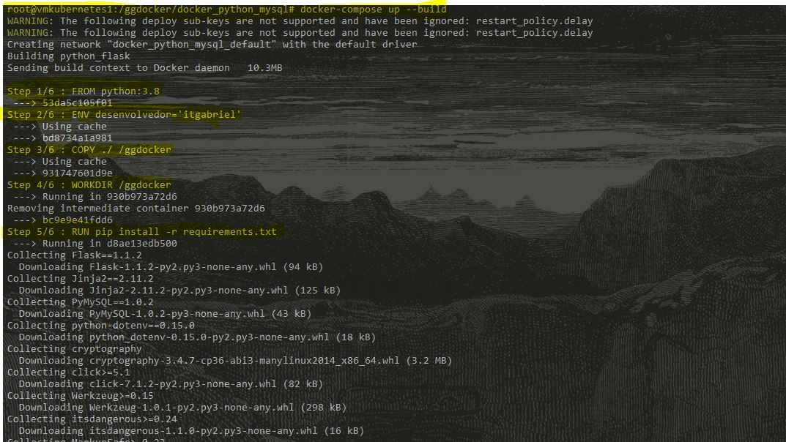

## -  Projeto teste - orquestração de container's

  - - #### Este é um projeto para teste de orquestração de container's, onde foi utilizado docker para provisionamento de container's, docker-compose para gerênciamento de mais de um do mesmo, assim possibilitando o desenvolvimento de uma aplicação fullt-stack simples para teste de CRUD.

## - Requisitos


#### Geral
```bash
    - Uma maquina com windows, macSO ou Linux. (desde que funciona docker e docker-compose)
```

#### Teste na própria maquina ou vm's/containers.
```bash
    # Em caso de virtualbox ou semelhante, realizar o git clone do projeto.
    - Docker e docker-compose instalados,
    
    # Em teste local sem vm's, realizar instalação de servidor mysql e python 3.
    
```

## - Inicio
```
No diretório do projeto editar/ajustar o arquivo '.env'

O arquivo .env contem as variaveis de ambiente, onde caso o teste for realizado de forma local, deixar como esta abaixo,
porém caso for via docker-compose, preencher os campos vazios.

    - DB_ADDRESS=""
    - DB_ROOT_USER="root"

    - DB_ROOT_PASSWORD="root"
    - DB_USER=""

    - DB_PASSWORD=""
    - DB_DATABASE="docker_project"

    - FLASK_ADDRESS=0.0.0.0
    - FLASK_PORT=8000

```
## Comando

```
  # Para testes com containers, utilizar o comando abaixo
  - docker-compose up --build
  
  # Caso maquina virtual ou local, antes de executar o comando abaixo, certificar-se que o há um servidor de mysql:
  
  # Realizar a instalação das dependencias do projeto
  - python -m pip install -r requeriments.txt
  - - python main.py
```

## Em funcionamento

```
    ## - Listagem dos arquivos
    

    ## - Iniciando o docker-compose
    
    

    ## - Projeto em andamento
    
    
```